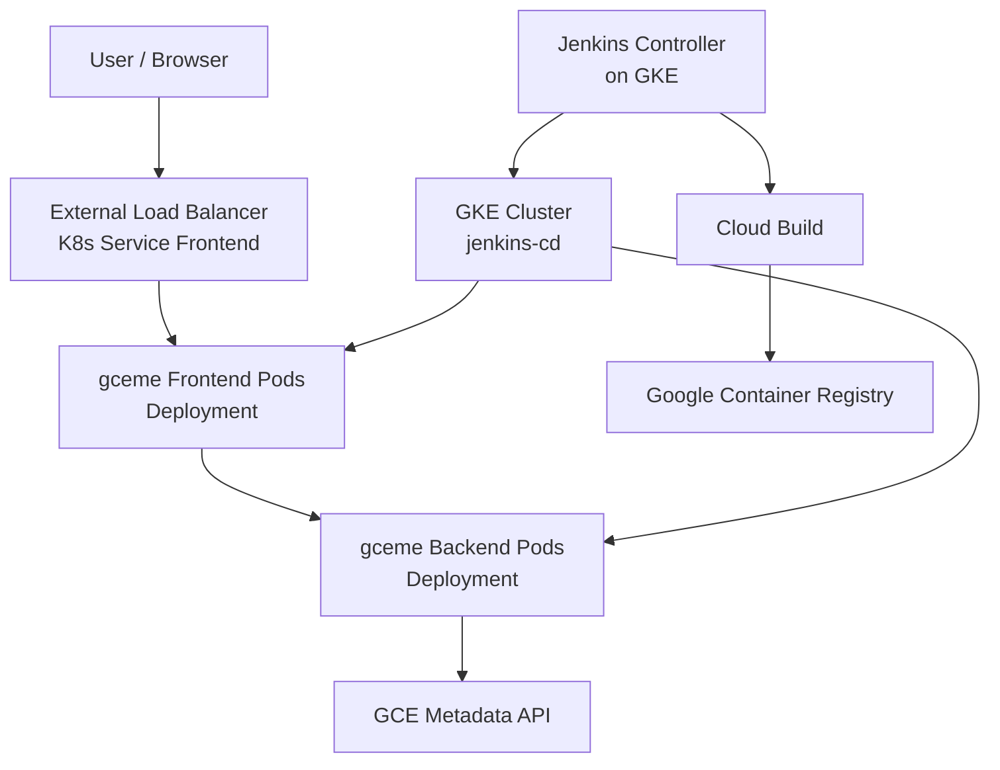
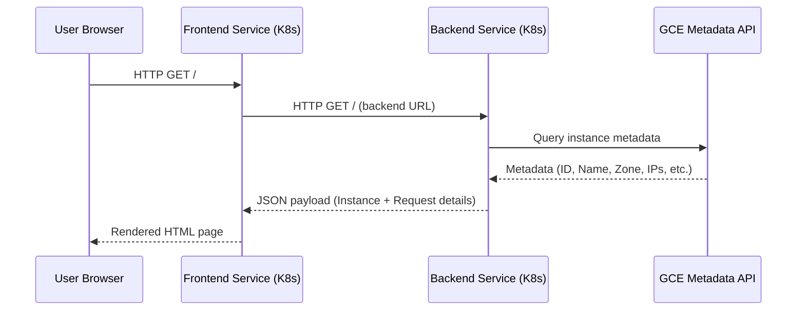
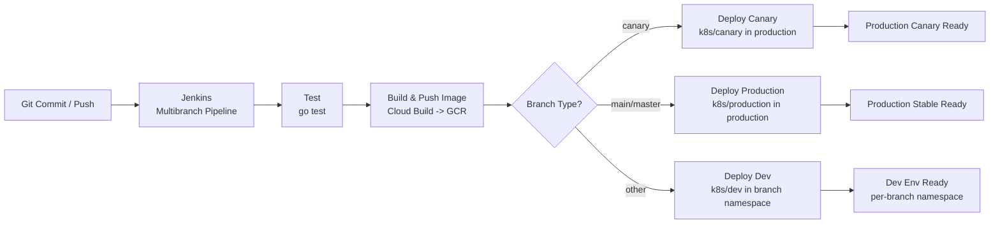
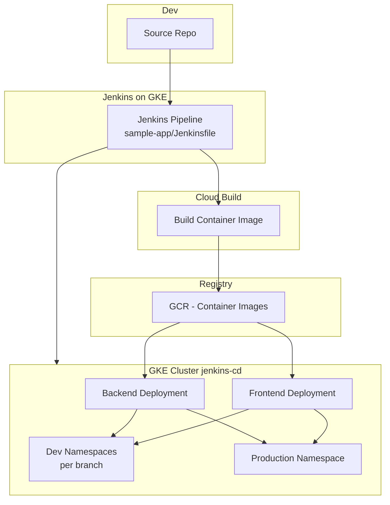

# CI/CD with Jenkins on Google Kubernetes Engine (GKE)

## Project Title

**CI/CD with Jenkins on Google Kubernetes Engine (GKE)**

---

## Short Project Overview

This repository demonstrates an end‑to‑end CI/CD pipeline for a  Go web application deployed on Google Kubernetes Engine (GKE) and built using Jenkins running inside the same GKE cluster.

The setup showcases:

- A Go microservice with separate frontend and backend modes, compiled into a container image.
- Kubernetes manifests for **dev**, **canary**, and **production** environments.
- A Jenkins pipeline that:
  - Runs Go tests.
  - Builds and pushes images using **Google Cloud Build**.
  - Deploys to GKE using the **Google Kubernetes Engine Jenkins plugin**.
- A Helm‑based Jenkins controller configuration tailored for GKE.

This makes it suitable as a DevOps / Cloud Engineering portfolio piece demonstrating cloud‑native CI/CD on GCP.

---

## Key Features

- **Containerized Go Web App**
  - Single binary running in either **frontend** or **backend** mode, implemented in [`main.go`](sample-app/main.go) and [`html.go`](sample-app/html.go).
- **Environment‑Aware Backend**
  - Backend retrieves GCE instance metadata via [`newInstance()`](sample-app/main.go:154) and renders it in a frontend HTML template.
- **Multi‑Environment Kubernetes Manifests**
  - Dedicated manifests for:
    - **Development namespaces** (per branch).
    - **Canary** rollout in the `production` namespace.
    - **Production** rollout in the `production` namespace.
- **Jenkins Declarative Pipeline**
  - Single Jenkins pipeline defined in [`Jenkinsfile`](sample-app/Jenkinsfile) with stages:
    - `Test`
    - `Build and push image with Container Builder`
    - `Deploy Canary`
    - `Deploy Production`
    - `Deploy Dev` (feature branches).
- **Cloud‑Native CI/CD**
  - Docker image built by Google Cloud Build and stored in Google Container Registry (GCR).
  - Deployments to GKE via Jenkins agents running `kubectl` and the **KubernetesEngineBuilder**.
- **Jenkins on GKE via Helm**
  - Jenkins controller customized through [`values.yaml`](jenkins/values.yaml) with GCP‑specific plugins and resources.

---

## Tech Stack

**Application**

- Language: Go (Golang) 1.10
- HTTP server and HTML templating via standard library (`net/http`, `html/template`), as seen in [`main.go`](sample-app/main.go).
- GCE metadata integration via `cloud.google.com/go/compute/metadata`.

**Containerization & Registry**

- Docker image built from [`Dockerfile`](sample-app/Dockerfile).
- Google Container Registry (GCR) for container image storage.

**Orchestration & Infrastructure**

- Google Kubernetes Engine (GKE) cluster:
  - Cluster name: `jenkins-cd`
  - Default zone: `us-central1-b` (from [`Jenkinsfile`](sample-app/Jenkinsfile)).
- Kubernetes manifests for:
  - Services: [`backend.yaml`](sample-app/k8s/services/backend.yaml), [`frontend.yaml`](sample-app/k8s/services/frontend.yaml)
  - Environments:
    - Dev: [`backend-dev.yaml`](sample-app/k8s/dev/backend-dev.yaml), [`frontend-dev.yaml`](sample-app/k8s/dev/frontend-dev.yaml), [`default.yml`](sample-app/k8s/dev/default.yml)
    - Canary: [`backend-canary.yaml`](sample-app/k8s/canary/backend-canary.yaml), [`frontend-canary.yaml`](sample-app/k8s/canary/frontend-canary.yaml)
    - Production: [`backend-production.yaml`](sample-app/k8s/production/backend-production.yaml), [`frontend-production.yaml`](sample-app/k8s/production/frontend-production.yaml)

**CI/CD & Tooling**

- Jenkins (controller configured via Helm values in [`values.yaml`](jenkins/values.yaml)).
- Jenkins Kubernetes plugin and Google Cloud / GKE plugins.
- Google Cloud Build (`gcloud builds submit`) invoked from [`Jenkinsfile`](sample-app/Jenkinsfile).
- `kubectl` and `gcloud` CLI tools inside Jenkins agent pods.
- Dependency management for Go via `dep` ([`Gopkg.toml`](sample-app/Gopkg.toml), [`Gopkg.lock`](sample-app/Gopkg.lock)).

---

## Repository Structure

```text
.
├── LICENSE
├── README.md
├── jenkins/
│   └── values.yaml
└── sample-app/
    ├── Dockerfile
    ├── Gopkg.lock
    ├── Gopkg.toml
    ├── Jenkinsfile
    ├── html.go
    ├── main.go
    ├── main_test.go
    └── k8s/
        ├── services/
        │   ├── backend.yaml
        │   └── frontend.yaml
        ├── dev/
        │   ├── backend-dev.yaml
        │   ├── default.yml
        │   └── frontend-dev.yaml
        ├── canary/
        │   ├── backend-canary.yaml
        │   └── frontend-canary.yaml
        └── production/
            ├── backend-production.yaml
            └── frontend-production.yaml
```

Key components:

- Root:
  - [`README.md`](README.md): Documentation (this file).
  - [`LICENSE`](LICENSE): Project license (Apache 2.0 style as indicated by source headers).
- Jenkins:
  - [`values.yaml`](jenkins/values.yaml): Helm values for Jenkins controller and agents on GKE.
- Application (sample-app):
  - Source code: [`main.go`](sample-app/main.go), [`html.go`](sample-app/html.go), [`main_test.go`](sample-app/main_test.go).
  - CI/CD definition: [`Jenkinsfile`](sample-app/Jenkinsfile).
  - Container definition: [`Dockerfile`](sample-app/Dockerfile).
  - Kubernetes manifests under [`k8s/`](sample-app/k8s).

---

## Installation / Setup

### 1. Prerequisites

- Google Cloud Platform (GCP) project:
  - Example project ID from pipeline: `gke-jenkins-cicd-459015` (configured in [`Jenkinsfile`](sample-app/Jenkinsfile)).
- Tools installed locally:
  - `gcloud` CLI
  - `kubectl`
  - `helm` (Helm 3)
  - `docker`
  - `git`
- Enabled GCP APIs:
  - Kubernetes Engine API
  - Cloud Build API
  - Container Registry (or Artifact Registry)

### 2. Clone the Repository

```bash
git clone https://github.com/<your-username>/gke-jenkins-cicd.git
cd gke-jenkins-cicd
```

### 3. Create the GKE Cluster

```bash
gcloud config set project gke-jenkins-cicd-459015

gcloud container clusters create jenkins-cd \
  --zone us-central1-b \
  --num-nodes 3

gcloud container clusters get-credentials jenkins-cd \
  --zone us-central1-b
```

### 4. Install Jenkins via Helm

Use the Jenkins chart with the provided values in [`values.yaml`](jenkins/values.yaml):

```bash
helm repo add jenkins https://charts.jenkins.io
helm repo update

helm upgrade --install jenkins jenkins/jenkins \
  --namespace jenkins \
  --create-namespace \
  -f jenkins/values.yaml
```

This configuration:

- Installs required plugins: `kubernetes`, `git`, `google-oauth-plugin`, `google-kubernetes-engine`, etc.
- Configures the Jenkins controller resources and service account (`cd-jenkins`).

### 5. Configure Jenkins Credentials

In the Jenkins UI:

1. Create a GCP service account with:
   - Permissions to use Cloud Build.
   - Permissions to push to GCR.
   - Permissions to manage GKE cluster `jenkins-cd`.
2. Add its credentials to Jenkins as a **Google Service Account from private key**.
3. Set the credentials ID equal to the project ID (e.g. `gke-jenkins-cicd-XXXXX`) to match `JENKINS_CRED` in [`Jenkinsfile`](sample-app/Jenkinsfile).

### 6. Create a Multibranch or Pipeline Job

- Create a **Multibranch Pipeline** or **Pipeline** job in Jenkins.
- Point it to this repository.
- For a simple Pipeline job, configure it to use the Jenkinsfile at `sample-app/Jenkinsfile`.

---

## Usage / Execution

### Local Development (Optional)

From the `sample-app` directory:

```bash
cd sample-app
```

Run the backend:

```bash
go run main.go -port 8081
```

Run the frontend, pointing it at the backend:

```bash
go run main.go -frontend -backend-service http://127.0.0.1:8081 -port 8080
```

- The HTTP server entrypoint is [`main()`](sample-app/main.go:48).
- The backend HTTP handlers are configured in [`backendMode()`](sample-app/main.go:72).
- The frontend HTTP handlers and HTML template rendering are configured in [`frontendMode()`](sample-app/main.go:88) and [`html`](sample-app/html.go:19).

Open `http://localhost:8080` in a browser to see the rendered instance and request details.

### Build the Docker Image Manually

From `sample-app`:

```bash
docker build -t gcr.io/<PROJECT_ID>/gceme:local .
```

The Dockerfile is defined in [`Dockerfile`](sample-app/Dockerfile) and:

- Uses `golang:1.10`.
- Builds and installs the Go binary (`app`).
- Sets `CMD ["app"]` as the container entrypoint.

### Run the CI/CD Pipeline

The primary flow is driven by Jenkins using [`Jenkinsfile`](sample-app/Jenkinsfile):

1. Push a branch to your Git repository.
2. Jenkins automatically:
   - Runs tests (`go test`).
   - Builds and pushes a new container image via Cloud Build.
   - Deploys to an environment based on the branch name:
     - `main` or `master` → **production**.
     - `canary` → **production canary**.
     - Any other branch → **dev namespace named after the branch**.

To discover the production frontend URL, Jenkins executes:

```groovy
sh("echo http://`kubectl --namespace=production get service/${FE_SVC_NAME} -o jsonpath='{.status.loadBalancer.ingress[0].ip}'` > ${FE_SVC_NAME}")
```

You can also run:

```bash
kubectl --namespace production get svc
```

and open the external IP of the frontend service.

---

## Architecture Overview

At a high level, the system consists of:

- **Jenkins on GKE**  
  Running as a Kubernetes Deployment installed via Helm, configured by [`values.yaml`](jenkins/values.yaml). It schedules pipeline agents as pods with `golang`, `gcloud`, and `kubectl` containers.

- **GCEME Application (Frontend + Backend)**  
  A Go binary in [`main.go`](sample-app/main.go) that can run in:
  - Backend mode (JSON API returning GCE metadata and request details).
  - Frontend mode (HTML UI rendering the backend’s JSON via template defined in [`html.go`](sample-app/html.go)).

- **Kubernetes Infrastructure**  
  Multiple namespaces and manifests in [`k8s/`](sample-app/k8s) for:
  - `dev` branches.
  - `production` with canary and stable deployments.
  - Shared services such as frontend/backend Services in [`services`](sample-app/k8s/services).

- **Google Cloud Services**  
  - **GKE**: Runs Jenkins and the application pods.
  - **GCR**: Stores container images.
  - **Cloud Build**: Builds images from source.
  - **GCE Metadata API**: Provides instance metadata to the backend via `metadata` client used in [`newInstance()`](sample-app/main.go:154).

### System / Architecture Diagram (Mermaid)



---

## Data Flow Overview

Application‑level data flow:

1. User sends an HTTP request to the **frontend service** (LoadBalancer Service).
2. Frontend handler in [`frontendMode()`](sample-app/main.go:88) issues an HTTP request to the backend service URL (configurable via `-backend-service` flag).
3. Backend handler in [`backendMode()`](sample-app/main.go:72):
   - Calls [`newInstance()`](sample-app/main.go:154) to query the GCE metadata API (if running on GCE).
   - Uses `httputil.DumpRequest` to capture the incoming request from the load balancer.
   - Serializes the gathered data as JSON.
4. Frontend receives JSON, unmarshals into an [`Instance`](sample-app/main.go:32) struct, and renders the HTML template defined in [`html`](sample-app/html.go:19).
5. The browser displays instance and network information in a simple Materialize‑styled UI.

### Dataflow Diagram (Mermaid)



---

## CI/CD or Automation Flow

The Jenkins pipeline in [`Jenkinsfile`](sample-app/Jenkinsfile) defines the following stages:

1. **Agent Definition**

   - Uses a Kubernetes agent pod with three containers:
     - `golang` (for `go test`).
     - `gcloud` (for Cloud Build).
     - `kubectl` (for deployment).
   - Service account: `cd-jenkins` (matches `serviceAccount.name` in [`values.yaml`](jenkins/values.yaml)).

2. **Stage: Test**

   - Container: `golang`.
   - Symlinks repository into GOPATH and runs:

     ```bash
     go test
     ```

   - Tests implemented in [`main_test.go`](sample-app/main_test.go), including a basic check for GCE environment using `metadata.OnGCE()`.

3. **Stage: Build and push image with Container Builder**

   - Container: `gcloud`.
   - Executes:

     ```bash
     gcloud builds submit -t ${IMAGE_TAG} .
     ```

   - `${IMAGE_TAG}` is computed as:

     ```bash
     IMAGE_TAG = "gcr.io/${PROJECT}/${APP_NAME}:${env.BRANCH_NAME}.${env.BUILD_NUMBER}"
     ```

4. **Stage: Deploy Canary** (branch `canary` only)

   - Container: `kubectl`.
   - Patches canary manifests under [`k8s/canary`](sample-app/k8s/canary) to use the new `${IMAGE_TAG}`.
   - Applies:
     - Services in [`k8s/services`](sample-app/k8s/services).
     - Canary manifests in [`k8s/canary`](sample-app/k8s/canary) in the `production` namespace.
   - Verifies deployments via `KubernetesEngineBuilder`.

5. **Stage: Deploy Production** (`main` / `master` branches)

   - Container: `kubectl`.
   - Updates image references in production manifests under [`k8s/production`](sample-app/k8s/production).
   - Applies:
     - Services in [`k8s/services`](sample-app/k8s/services).
     - Production manifests in [`k8s/production`](sample-app/k8s/production).
   - Verifies deployments with `verifyDeployments: true`.

6. **Stage: Deploy Dev** (all other branches)

   - Container: `kubectl`.
   - Creates a namespace per branch (if missing):

     ```bash
     kubectl get ns ${BRANCH_NAME} || kubectl create ns ${BRANCH_NAME}
     ```

   - Mutates frontend service manifest to `ClusterIP` for internal access.
   - Updates dev manifests under [`k8s/dev`](sample-app/k8s/dev) with `${IMAGE_TAG}`.
   - Deploys services and dev manifests into the branch‑namespace.
   - Prints instructions to access the environment via `kubectl proxy`.

### CI/CD Pipeline Diagram (Mermaid)



---

## Diagrams

### System / Architecture Diagram

(See the "System / Architecture Diagram" section above for the Mermaid definition.)

### Application or Infrastructure Flowchart (Mermaid)



### Dataflow Diagram

(See the "Dataflow Diagram" in the Data Flow Overview section.)

### CI/CD Pipeline Diagram

(See the "CI/CD Pipeline Diagram" in the CI/CD or Automation Flow section.)

All diagrams use valid Mermaid syntax and render in GitHub Markdown.

---

## Future Improvements

Potential enhancements for this project:

- **Modernize the Go Toolchain**
  - Update to a recent Go version.
  - Replace `dep` ([`Gopkg.toml`](sample-app/Gopkg.toml), [`Gopkg.lock`](sample-app/Gopkg.lock)) with Go modules (`go.mod`, `go.sum`).

- **Parameterize Environment Configuration**
  - Externalize service URLs, image tags, and namespace naming patterns via Helm charts or Kustomize instead of `sed` mutations in the pipeline.

- **Improve Observability**
  - Add structured logging and metrics (e.g. Prometheus).
  - Add health and readiness probes in Kubernetes manifests beyond `/healthz`.

- **Hardening & Security**
  - Use Workload Identity or a more granular service account model instead of a broad `cd-jenkins` account.
  - Introduce image scanning stages (e.g. Container Analysis, Trivy).

- **Test Coverage**
  - Extend tests beyond [`TestGCE`](sample-app/main_test.go:25) to include HTTP handlers and HTML rendering (integration tests).

- **Multi‑Region & Blue/Green Strategies**
  - Extend deployment logic to support multi‑cluster/multi‑region or full blue/green deployments in addition to canary.

---

## Author

Maintained by Dmitry Zhuravlev.

Original application concept is based on the GCEME application and adapted here as a complete CI/CD demonstration on GKE using Jenkins for DevOps / Cloud Engineering portfolio and technical review purposes.

